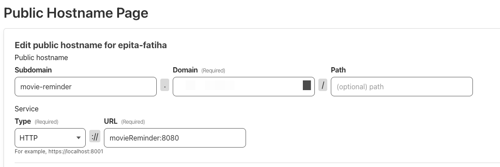

# Docker
## Cloner le projet

```shell
git clone git@github.com:FatihaBHM/MovieReminderV2.git
```

---

## Créer un fichier .env

Créer un fichier .env à la racine du projet avec les variables d'environnement suivantes :
```
POSTGRES_PASSWORD=samsamsam
POSTGRES_DB=movieReminder
POSTGRES_USER=forma
POSTGRES_URL=localhost
POSTGRES_PORT=5432
JWT_SECRET=mettre_une_cle_secrete
JWT_EXPIRATION=1440
MOVIE_PORT=8080
```

`JWT_EXPIRATION` est en minutes.

Si vous souhaitez utiliser docker-compose.server-sam.yml, vous devez ajouter les variables d'environnement suivantes :
```
TUNNEL_TOKEN=mettre_une_cle_secrete // récupérer sur cloudlfare
```

Puis sur Cloudflare, dans les tunnels, ajouter un tunnel et récupérer le token.

Puis dans le Public Hostanme, ajouter le nom de domaine que vous souhaitez utiliser ainsi que le type et l'url: 
- Type = `HTTP`
- URL = `movieNetwork:8080`



---

## Lancer l'application

Pour lancer l'application avec Docker, il suffit de lancer la commande suivante à la racine du projet :
```shell
docker-compose up
```
ou
```shell
docker-compose up -d # pour lancer en arrière-plan
```

ou

```shell
docker-compose -f docker-compose.server-sam.yml up - d
```

---

## Arrêter l'application

Pour arrêter l'application, il suffit de lancer la commande suivante à la racine du projet :
```shell
docker-compose down
```

---

## Accéder à l'application

L'application est accessible à l'adresse suivante, si vous lancez cela en local :
```
http://localhost:8080
```

---

## Forcer la reconstruction des images

Pour forcer la reconstruction des images, il suffit de lancer la commande suivante à la racine du projet :
```shell
docker-compose up --build
```
ou
```shell
docker-compose up -d --build # pour lancer en arrière-plan
```
ou
```shell
docker-compose up --build --force-recreate # pour forcer la reconstruction des images
```


